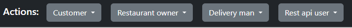

# Food Delivery App

Project made for educational purpose. Project uses Java and related technologies.

## Description

Application allow to create account and log in to it.
Depend on the role, user can do different actions.
* As Restaurant owner, user can add new restaurant, manage it and add new menu
* As Customer, user can make an order
* Delivery man and Rest api user are under development, you can only log in and log out

## Getting Started

### Dependencies

* IDE like IntelliJ IDEA to run project
* Docker to run JPA TestContainers (if You run Gradle build - not required)
* PostgreSQL to run database
* Java 21

or

* IDE like IntelliJ IDEA to run project build
* Docker to run JPA TestContainers and application

### Installing

* Pull repository
* Configure database as you wish in: \src\main\resources\application.yaml
  * default:
    * url: jdbc:postgresql://localhost:5432/food_delivery
    * username: postgres
    * password: postgres
* Configure server as you wish in: \src\main\resources\application.yaml
  * default:
    * port: 8080
* Run application in your IDE [FoodDeliveryApplication.java](src%2Fmain%2Fjava%2Fpl%2Fproject%2FFoodDeliveryApplication.java)
* Run URL: http://localhost:8080/food-delivery/ in your browser

(You don't need Docker to run application, but you need it to run Gradle build - tests uses Testcontainers)

or

* Pull repository
* Configure database and server as you wish in: \docker-compose.yml
  * default server port: 8080
* Adjust docker-compose version in: \docker-compose.yml (first parameter)
* Run Docker
* Open terminal and run command:
  * docker-compose up
* Run URL: http://localhost:8080/food-delivery/ in your browser
    

### Executing program

* Run URL: http://localhost:8080/food-delivery/ in your browser
* You will see main panel
* From there You can create new user for chosen role or log in
* You can use default log in authentication values shown on main page

* Restaurant owner - main functionalities almost finished
* Customer - allows creating new order, many functionalities still in development
* Delivery man - only account creation, log in / log out available
* Rest api user - only account creation, log in / log out available

## Help

Application is still in development. Some functions haven't developed yet.
Application still need many fixes and tests.

## Authors

* Łukasz Cywiński
  * lukasz.cywin@gmail.com

## Version History

* 1.0-SNAPSHOT
    * Still under development

## Used Technology

* Spring Boot
* Spring MVC
* Spring Data JPA
* Spring Security
* PostgreSQL
* TestContainers
* HTML + Thymeleaf + Bootstrap
